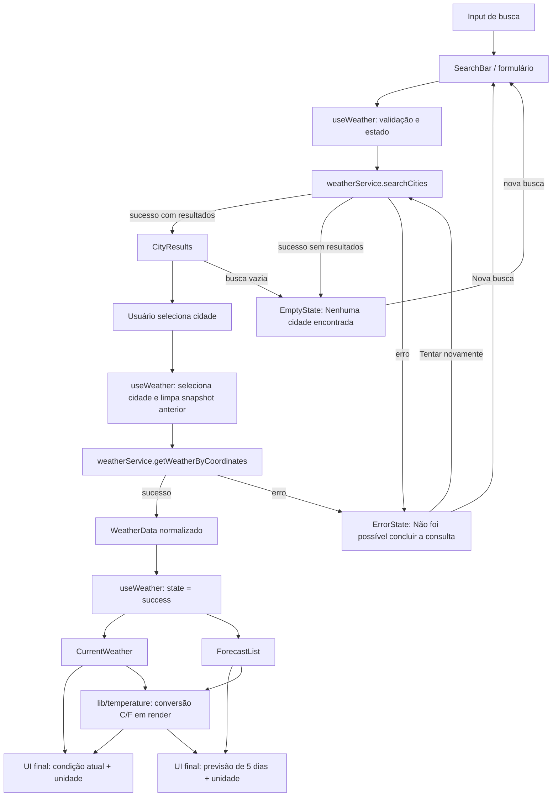

# Plano Técnico — Weather App

Este plano deriva de [`specs/weather-app-spec.md`](../specs/weather-app-spec.md), fonte da verdade para escopo e comportamento. Os identificadores FR, AC e NFR abaixo preservam a rastreabilidade. O documento define arquitetura e contratos, não a implementação final.

## Architecture

SPA React com fluxo unidirecional e quatro responsabilidades pequenas:

- **Apresentação (`components/`)**: busca, seleção da cidade, condições atuais, previsão, unidade e estados acessíveis. Recebe dados e callbacks por props; não possui estado de domínio nem faz chamadas HTTP.
- **Orquestração e estado (`hooks/`)**: `useWeather` coordena busca, seleção, carregamento, erro, retry e unidade. Limpa dados anteriores ao selecionar outra cidade e impede que respostas fora de ordem alterem a seleção vigente.
- **Acesso a dados (`services/`)**: `weatherService` encapsula `fetch`, timeout, validação e adaptação das respostas da Open-Meteo para os tipos internos. Não depende de React nem conhece a interface.
- **Funções puras (`lib/`)**: conversão e arredondamento de temperatura, datas no fuso da cidade, formatação e tradução de códigos WMO. Não fazem I/O nem mantêm estado.
- **Contratos (`types/`)**: tipos compartilhados e normalizados, independentes do JSON do provedor.

Dependências apontam para dentro: `App` compõe componentes e hook; o hook usa serviço, funções puras e tipos; o serviço usa tipos; `lib/` não depende das outras camadas. Assim, apresentação, regras de transformação e integração de rede podem mudar ou ser testadas sem acoplar umas às outras.



**Rastreabilidade:** FR-01 a FR-06; AC-01.1–AC-06.3; NFR-02, NFR-04 e NFR-05.

## Tech Stack

| Área | Decisão | Motivo |
| --- | --- | --- |
| Linguagem e UI | TypeScript strict, React 19 e Vite 8 | Stack já configurada no repositório; tipos explícitos e aplicação cliente simples. |
| Estilos | Tailwind CSS 3 | Já configurado; permite compor a interface responsiva sem introduzir outra dependência de UI. |
| Dados | Open-Meteo Geocoding e Forecast | Provedor exigido pela spec, sem chave de API no MVP; cobertura, licença, atribuição e limites devem ser validados antes da publicação. |
| Estado | Estado local React, concentrado em `useWeather` | O escopo tem uma tela e não exige estado global ou persistência. |
| Testes unitários | Vitest, Testing Library e `user-event` | Já configurados; cobrem funções puras, serviço e interação acessível. |
| Testes de navegador | Playwright | Já configurado; valida fluxos completos, teclado e viewports. |
| Qualidade e pacotes | Biome e pnpm | Ferramentas e scripts já definidos no projeto. |

Não adicionar biblioteca de estado, cliente HTTP, ícones ou cache sem uma necessidade comprovada: `fetch`, React e os utilitários já existentes atendem ao MVP.

## Project Structure

Estrutura de destino para a aplicação, respeitando as convenções do projeto:

```text
src/
├── components/
│   ├── SearchBar.tsx
│   ├── CityResults.tsx
│   ├── CurrentWeather.tsx
│   ├── ForecastList.tsx
│   ├── UnitToggle.tsx
│   └── states/                 # loading, erro, vazio e ausência de seleção
├── hooks/
│   └── useWeather.ts
├── services/
│   └── weatherService.ts       # fetch, timeout, validação e adaptação
├── lib/
│   ├── temperature.ts
│   ├── weatherCodes.ts
│   └── dateTime.ts
├── types/
│   └── weather.ts
├── App.tsx
└── main.tsx
tests/
├── unit/                       # funções, serviço e componentes
└── e2e/                        # fluxos de usuário em Playwright
```

Manter um componente por arquivo. Testes podem seguir a organização já adotada ao iniciar a implementação; não é necessário criar abstrações de domínio além desses módulos.

**Como a separação facilita os testes:** `lib/` permite testes unitários determinísticos sem DOM ou rede; `services/` pode testar parsing, parâmetros, respostas parciais, erros e timeout com `fetch` controlado; `hooks/` pode testar transições de estado, retry e concorrência com o serviço simulado; `components/` pode ser validado com Testing Library a partir de props, teclado e acessibilidade. Playwright fica reservado aos fluxos integrados essenciais, com as APIs interceptadas para resultados determinísticos.

## Data Model

Tipos internos representam dados normalizados. Temperaturas são armazenadas em Celsius; valores ausentes são `null`, nunca estimados.

```ts
// Unidade usada para exibir as temperaturas.
export type Unit = 'celsius' | 'fahrenheit';

export interface City {
  id?: number; // Identificador da localidade no geocoding.
  name: string; // Nome preservado como retornado pela busca.
  country?: string; // País da localidade.
  countryCode?: string; // Código do país, quando fornecido.
  admin1?: string; // Estado ou região administrativa.
  admin2?: string; // Município ou subdivisão, quando fornecido.
  latitude: number; // Latitude usada para consultar a previsão.
  longitude: number; // Longitude usada para consultar a previsão.
}

export interface CurrentWeather {
  temperatureC: number | null; // Temperatura atual convertida para Celsius.
  weatherCode: number | null; // Código de condição WMO retornado pela API.
  observedAt: string | null; // Instante ISO normalizado, quando disponível.
  localTime: string | null; // Horário local informado pelo provedor.
  humidityPercent?: number | null; // Umidade relativa atual.
  windSpeedKmh?: number | null; // Velocidade atual do vento.
  precipitationMm?: number | null; // Precipitação no intervalo atual.
  pressureHpa?: number | null; // Pressão atmosférica atual.
}

export interface ForecastDay {
  date: string; // Data YYYY-MM-DD no calendário local da cidade.
  weatherCode: number | null; // Código de condição WMO do dia.
  minimumC: number | null; // Temperatura mínima em Celsius.
  maximumC: number | null; // Temperatura máxima em Celsius.
  precipitationProbabilityPercent?: number | null; // Probabilidade máxima diária de precipitação.
  precipitationSumMm?: number | null; // Acumulado diário de precipitação.
}

export interface WeatherData {
  city: City; // Localidade selecionada para estes dados.
  current: CurrentWeather; // Condições atuais; valores indisponíveis são null.
  forecast: ForecastDay[]; // Até cinco dias, com campos ausentes como null.
  timezone: string | null; // Fuso IANA retornado para a localidade.
  source: 'Open-Meteo'; // Fonte dos dados apresentada na interface.
}
```

Busca normalizada retorna `City[]` com até cinco itens na ordem do provedor. O rótulo da cidade combina nome e qualificadores geográficos necessários para tornar homônimos distintos; coordenadas identificam a consulta meteorológica, não o texto exibido.

```ts
export type RequestStatus = 'idle' | 'loading' | 'success' | 'error' | 'empty';

export interface WeatherUiState {
  status: RequestStatus; // estado explícito da tela, derivado da última operação
  phase: 'search' | 'weather'; // qual operação está em andamento ou gerou o status atual
  query: string; // texto da busca, preservado mesmo após erro ou vazio
  cityResults: City[]; // resultados de geocoding da busca mais recente
  selectedCity: City | null; // cidade cujos dados estão (ou deveriam estar) em exibição
  weather: WeatherData | null; // snapshot da cidade selecionada; null antes do sucesso
  unit: Unit; // unidade de exibição; não afeta os valores armazenados
  errorMessage: string | null; // mensagem apresentada quando status é 'error'
}
```

`status` cobre as cinco situações exigidas pela spec: `idle` (nenhuma busca ainda, orientação inicial), `loading` (busca ou consulta meteorológica pendente), `success` (resultados de busca ou clima exibidos), `empty` (busca concluída sem correspondências) e `error` (falha de rede, API, timeout ou validação). `phase` distingue se o status corrente descreve a busca de cidade ou a consulta meteorológica, já que ambas usam os mesmos cinco nomes de status.

**Rastreabilidade:** FR-01–FR-04 e FR-06; AC-01.2–AC-01.3, AC-02.1–AC-03.6, AC-04.1–AC-04.5 e AC-06.1–AC-06.3.

## Data Flow

1. A pessoa submete a busca pelo botão ou Enter. A interface remove espaços externos, preserva acentos e pontuação e rejeita texto sem letra ou dígito antes de chamar o serviço.
2. `useWeather` define `status: 'loading'` com `phase: 'search'`; o serviço consulta geocoding e limita resultados a cinco sem reordená-los. Resposta sem resultados produz `status: 'empty'`, mantém a busca editável e não consulta a previsão.
3. A pessoa seleciona uma cidade. O hook limpa imediatamente `weather`, define `selectedCity`, invalida/aborta a requisição anterior e muda para `status: 'loading'` com `phase: 'weather'` ao solicitar o clima pelas coordenadas.
4. O serviço combina dados atuais e diários por data, normaliza o fuso e representa ausências como `null`. Com fuso conhecido, produz cinco datas locais consecutivas; campos faltantes permanecem indisponíveis. Sem fuso, não calcula datas com o relógio/fuso do dispositivo.
5. O hook aceita somente a resposta da seleção mais recente e publica `status: 'success'` ou `status: 'error'`. Componentes renderizam os dados e estados; funções puras derivam unidade, rótulos e formatos.
6. A troca °C/°F atualiza apenas `unit`; a apresentação recalcula os valores a partir dos Celsius já carregados em `weather` a cada renderização, sem nova requisição.

**Rastreabilidade:** FR-01, FR-03, FR-04 e FR-06; AC-01.1–AC-01.7, AC-03.1–AC-03.6, AC-04.1–AC-04.5 e AC-06.1–AC-06.2.

## External APIs

As URLs e parâmetros ficam exclusivamente em `services/weatherService.ts`. Construir query strings com `URLSearchParams`, preservando caracteres Unicode do nome pesquisado.

**Geocoding**

```text
GET https://geocoding-api.open-meteo.com/v1/search
  ?name={query}&count=5&language=pt&format=json
```

`name` é a consulta já aparada; `count=5` limita resultados; `language=pt` solicita nomes localizados em português; `format=json` explicita o formato. Geocoding não usa os parâmetros `current` ou `daily`. Preservar a ordem retornada e não enviar a consulta meteorológica até uma pessoa selecionar um resultado.

Exemplo resumido de resposta:

```json
{
  "results": [
    {
      "id": 3390760,
      "name": "Recife",
      "latitude": -8.0539,
      "longitude": -34.8811,
      "country_code": "BR",
      "country": "Brasil",
      "admin1": "Pernambuco",
      "timezone": "America/Recife"
    }
  ],
  "generationtime_ms": 0.2
}
```

Mapeamento para `City`: `id`, `name`, `latitude` e `longitude` são copiados; `country_code` vira `countryCode`; `country`, `admin1` e `admin2` são copiados quando presentes. `timezone` da busca pode servir como metadado da localidade, mas a consulta forecast é a fonte para o fuso usado nos dados meteorológicos. Propriedades opcionais ausentes permanecem omitidas. A UI combina nome e qualificadores disponíveis para distinguir homônimos.

**Condições atuais e previsão**

```text
GET https://api.open-meteo.com/v1/forecast
  ?latitude={latitude}&longitude={longitude}
  &current=temperature_2m,weather_code,relative_humidity_2m,wind_speed_10m,precipitation,surface_pressure
  &daily=weather_code,temperature_2m_max,temperature_2m_min,precipitation_probability_max,precipitation_sum
  &forecast_days=5&timezone=auto&temperature_unit=celsius
```

`current` solicita temperatura, código WMO, umidade relativa, velocidade do vento, precipitação e pressão atuais. `daily` solicita código WMO, temperaturas mínima/máxima, probabilidade máxima de precipitação e acumulado de precipitação. `forecast_days=5` cobre hoje e os quatro dias seguintes; `timezone=auto` pede o fuso local das coordenadas; `temperature_unit=celsius` mantém o contrato interno estável.

Exemplo resumido de resposta:

```json
{
  "latitude": -8.05,
  "longitude": -34.88,
  "timezone": "America/Recife",
  "utc_offset_seconds": -10800,
  "current_units": {
    "time": "iso8601",
    "temperature_2m": "°C",
    "weather_code": "wmo code"
  },
  "current": {
    "time": "2026-09-30T10:00",
    "temperature_2m": 24.3,
    "weather_code": 2
  },
  "daily_units": {
    "time": "iso8601",
    "weather_code": "wmo code",
    "temperature_2m_max": "°C",
    "temperature_2m_min": "°C"
  },
  "daily": {
    "time": ["2026-09-30", "2026-10-01", "2026-10-02", "2026-10-03", "2026-10-04"],
    "weather_code": [2, 3, 61, 2, 1],
    "temperature_2m_max": [29.1, 28.5, 27.8, 29.0, 30.2],
    "temperature_2m_min": [22.0, 21.8, 22.4, 21.9, 22.1]
  }
}
```

Mapeamento para `WeatherData`:

- `city` é o `City` selecionado, não reconstruído a partir das coordenadas aproximadas da resposta.
- `current.temperature_2m` → `current.temperatureC`; `current.weather_code` → `current.weatherCode`; `current.relative_humidity_2m` → `current.humidityPercent`; `current.wind_speed_10m` → `current.windSpeedKmh`; `current.precipitation` → `current.precipitationMm`; `current.surface_pressure` → `current.pressureHpa`. `current.time` → `current.localTime`; combinar esse horário local com `utc_offset_seconds` para normalizar `current.observedAt` como instante ISO e calcular a idade. Se horário confiável estiver ausente, manter os campos temporais como `null` e comunicar atualidade desconhecida.
- Para cada índice `i` em `daily.time`, criar `forecast[i]`: `time[i]` → `date`, `weather_code[i]` → `weatherCode`, `temperature_2m_min[i]` → `minimumC`, `temperature_2m_max[i]` → `maximumC`, `precipitation_probability_max[i]` → `precipitationProbabilityPercent` e `precipitation_sum[i]` → `precipitationSumMm`. Índices ou valores ausentes viram `null`; nunca interpolar dados meteorológicos.
- `timezone` → `WeatherData.timezone`; `source` recebe `'Open-Meteo'`. Os códigos WMO são convertidos em rótulo/ícone acessível na apresentação, sem substituir o código no modelo.
- Se toda a previsão estiver ausente, manter as cinco datas consecutivas calculadas no fuso IANA para a cidade e preencher os campos meteorológicos com `null`. Sem fuso disponível, não usar o fuso do dispositivo: manter a previsão indisponível e informar o motivo.

O adaptador não deve depender de outros campos atuais, pois a spec não os exige. Uma resposta HTTP bem-sucedida com campos meteorológicos ausentes é dado parcial, não motivo para inventar valores nem descartar campos válidos. Timeout é de oito segundos por requisição.

**Rastreabilidade:** FR-01–FR-03 e FR-06; AC-01.1–AC-01.6, AC-02.1–AC-02.5 e AC-03.1–AC-03.6; NFR-04, NFR-05 e NFR-07.

## State Management

**Onde o estado vive:** todo o estado de domínio fica em `WeatherUiState`, mantido pelo hook `useWeather` com `useState`/`useReducer` locais a `App`. Não há estado global, contexto compartilhado ou store externa; componentes são controlados via props e callbacks vindos do hook.

**Transições dos estados explícitos:**

- `idle → loading` (`phase: 'search'`) ao submeter uma busca válida.
- `loading → success` com `cityResults` preenchido, ou `loading → empty` quando o geocoding responde sem correspondências (busca permanece editável, nenhuma consulta meteorológica é iniciada).
- `loading → error` (`phase: 'search'`) em falha de rede, API ou timeout da busca.
- Ao selecionar uma cidade: `selectedCity` é definido, `weather` é limpo imediatamente e o status muda para `loading` com `phase: 'weather'`.
- `loading → success` (`phase: 'weather'`) com o `WeatherData` normalizado, mesmo que campos internos estejam `null`; `loading → error` (`phase: 'weather'`) em falha de rede, API, timeout ou resposta incompatível.
- Qualquer novo envio de busca ou nova seleção pode partir de `success`, `empty` ou `error`, sempre reiniciando em `loading` para a operação correspondente.

**Concorrência e coerência:** uma nova seleção descarta imediatamente o `weather` anterior e associa um identificador à requisição em andamento (com `AbortController`). Somente a resposta cujo identificador corresponde à seleção vigente pode transicionar o status para `success` ou `error`; respostas tardias de seleções anteriores são ignoradas.

**Retry e nova busca:** `error` guarda `phase` e os parâmetros da operação que falhou. “Tentar novamente” repete somente essa operação (busca ou consulta meteorológica) sob ação explícita, sem retry automático. “Nova busca” limpa `selectedCity`, `weather` e `errorMessage`, volta ao `idle` e devolve o foco ao campo de busca.

**Unidade derivada, sem novo request:** `unit` inicia em `'celsius'` a cada sessão e não é persistida. `WeatherData` armazena somente Celsius; a conversão para Fahrenheit ocorre em `lib/temperature.ts` (`convertTemperature(valueC, unit)`), chamada durante a renderização dos componentes de apresentação. Trocar `unit` apenas atualiza esse estado local de UI — não altera `weather`, não aciona `weatherService` e não passa pelo status `loading`.

**Idade do dado:** derivada de `weather.current.observedAt` a cada renderização; sem instante confiável, exibir horário não informado e atualidade não verificada. Essa derivação também não dispara nova consulta.

Sem cache, armazenamento local, estado global ou atualização em segundo plano: nenhum deles é exigido pela spec.

**Rastreabilidade:** FR-02, FR-04–FR-06; AC-02.2, AC-02.5, AC-04.4, AC-05.3–AC-05.6 e AC-06.1–AC-06.2.

## Error Handling

Todo erro leva `status` para `'error'` com `errorMessage` definido e `phase` indicando a operação afetada; nenhuma resposta antiga é exibida como resultado da consulta que falhou. Os casos são tratados por categoria:

**Rede (sem conexão, requisição abortada, CORS, DNS):**

- `weatherService` propaga a falha como erro tipado; o hook encerra `loading` e define `errorMessage = 'Não foi possível concluir a consulta'`.
- Ações “Tentar novamente” (repete a mesma `phase` com os mesmos parâmetros) e “Nova busca” (retorna a `idle`) ficam sempre disponíveis; não há nova tentativa automática.

**API (HTTP de erro, corpo incompatível com o contrato esperado):**

- Status HTTP fora de 2xx ou JSON que não corresponde ao formato esperado é tratado como falha da operação, com a mesma mensagem e as mesmas ações do caso de rede.
- Entrada inválida (campo vazio, só espaços ou só pontuação) é validada antes do envio: orienta a informar um nome com letra ou dígito e não chama `weatherService`.
- Geocoding bem-sucedido sem resultados não é erro: status vai para `empty`, mostrando “Nenhuma cidade encontrada”, mantendo o texto editável e sem iniciar consulta meteorológica.

**Timeout (8 segundos por requisição):**

- `weatherService` aborta a requisição ao atingir 8 s; o hook trata isso como erro da `phase` em andamento, com `errorMessage = 'A consulta demorou mais que o esperado'` e as mesmas ações de retry/nova busca.

**Resposta parcial (campos meteorológicos ausentes, mas requisição bem-sucedida):**

- Isso não é um erro: o status permanece `success`, e os campos ausentes de `CurrentWeather`/`ForecastDay` são `null`, exibidos como “Indisponível” pela apresentação.
- Sem nenhum campo atual utilizável, mostrar “Condições atuais indisponíveis”; ausência de previsão não remove condições atuais já disponíveis.
- Sem fuso horário na resposta, mostrar “Previsão indisponível: fuso horário não informado” e não calcular datas pelo fuso do dispositivo.
- Dados antigos: marcar “Desatualizado” apenas quando a idade (derivada de `observedAt`) for maior que 60 minutos; sem horário confiável, mostrar “Horário de atualização não informado” e “Atualidade não verificada”.

**Carregamento e acessibilidade:** o status `loading` só aparece visualmente após 200 ms de espera; estados `loading`, `empty` e `error` são anunciados por tecnologia assistiva sem exigir foco manual na mensagem. Mensagens e ações têm nomes acessíveis, foco visível e operação completa por teclado. A aplicação não solicita localização precisa nem adiciona analytics ou rastreamento.

**Rastreabilidade:** FR-02, FR-03, FR-05 e FR-06; AC-02.2–AC-02.5, AC-03.4–AC-03.6, AC-05.1–AC-05.6; NFR-02, NFR-04 e NFR-07.

## Testing Strategy

- **Funções puras (Vitest):** conversão C/F, arredondamento ao inteiro mais próximo com empates para longe de zero, limites (-40 °C, 0 °C, 100 °C e 20,5 °C), datas locais, idade de dados e mapeamento dos códigos WMO.
- **Serviço (Vitest):** `fetch` controlado para geocoding, preservação de acentos/pontuação, máximo de cinco resultados e ordem, localidades homônimas, respostas válidas/parciais, arrays diários desalinhados, HTTP inválido, falha de rede e timeout de oito segundos.
- **Hook/componentes (Testing Library):** estados inicial/vazio/loading/erro/sucesso, submissão por botão e Enter, seleção limpa imediatamente a cidade anterior, retry explícito, unidade sem nova chamada, campos indisponíveis e anúncios acessíveis.
- **Concorrência:** resolver duas consultas meteorológicas fora de ordem e verificar que somente a cidade selecionada por último é exibida.
- **E2E (Playwright):** fluxo buscar → selecionar → ver condições e cinco dias → alternar unidade; testar nenhum resultado, erro/retry, teclado e ausência de associação com dados antigos. Interceptar APIs para respostas determinísticas.
- **Responsividade e desempenho:** verificar ausência de rolagem horizontal e controles de pelo menos 44 × 44 px entre 320 e 1920 px; cobrir viewports 360 × 800 e 1280 × 800. Com rede controlada, validar loading em até 200 ms, renderização até 500 ms após resposta e troca de unidade até 100 ms.
- **Compatibilidade/acessibilidade:** validar fluxos e interação por teclado/leitor de tela conforme WCAG 2.2 AA e matriz de navegadores NFR-05. Verificações automatizadas não substituem avaliação manual de acessibilidade.

Rodar `pnpm test`, `pnpm test:e2e`, `pnpm lint` e `pnpm build` como gates do projeto; testes de renderização devem controlar a resposta externa para não incluir latência da rede nos limites de UI.

**Rastreabilidade:** critérios AC-01.1–AC-06.3; NFR-01–NFR-06.

## Risks & Trade-offs

| Risco ou decisão | Tratamento / trade-off |
| --- | --- |
| Cobertura, licença, atribuição, limites e disponibilidade da Open-Meteo ainda precisam de validação. | Bloqueio antes da publicação; confirmar requisitos do provedor e mercados de lançamento (Open Questions 1–3 da spec). A abstração do serviço permite trocar a origem sem alterar a UI. |
| Geocoding pode retornar homônimos ou contexto regional incompleto. | Preservar a ordem do provedor, exibir qualificadores disponíveis e não afirmar distinção que os dados não sustentam. |
| Respostas parciais e horários/fusos ausentes podem induzir interpretação incorreta. | Tipos nullable, datas calculadas somente no fuso da cidade, estado explícito de indisponibilidade e atualidade desconhecida. |
| Respostas concorrentes podem atribuir o clima à cidade errada. | Invalidar requisição anterior e conferir identidade da requisição antes de publicar resposta; adicionar teste determinístico. |
| Conversão ou arredondamento podem divergir, sobretudo em empates negativos. | Guardar Celsius, derivar exibição e testar regra explícita de empate para longe de zero. Trade-off: pequena conversão por render, sem custo relevante nem estado duplicado. |
| Sem cache, nova seleção consulta novamente o provedor. | Aceitável para o MVP e evita política de expiração/invalidação não especificada; observar limites do provedor antes do lançamento. |
| Sem retry automático ou fallback meteorológico. | Mantém comportamento explícito, simples e coerente com a spec; indisponibilidade oferece retry manual, sem fonte alternativa. |
| Layout responsivo e WCAG 2.2 AA exigem verificação além de snapshots. | Cobrir viewport, teclado, nomes/estados acessíveis e complementar automação com revisão manual. |

**Rastreabilidade:** Risks, Open Questions e Out of Scope da spec; FR-01–FR-06 e NFR-01–NFR-07.